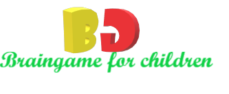

# MilestoneProject-2

<h1 align="center">
</h1>

 

[Braingame!]https://sabihaafroze.github.io/MP2/) is an educative and entertaining games designed for children aged between 4 to 9 years old. The children are grouped by toddler(4 to 6 years old) and kid (7 to 9 years old) so that they can use the website easily.
Two types of games are built here: One is Number & Maths which is a count game and another one is Memory game with sound effect. Both games can be easily played and entertaining 
as well as educative. For the parents there is another page where they can read the information about the games and they can also contact via the contact form for any query as well as their valuable feedback. 
The website is very playful and colorful so that the children can enjoy the environment.
 

[View the Braingame page](https://sabihaafroze.github.io/MP2/)

## Table of Contents
1. [**UX**](#ux)
    - [**Project Goals**](#project-goals)
    - [**Player goals**](#player-goals)
    - [**Parental goals**](#parental-goals)
    - [**Developer and Business Goals**](#developer-and-Business-Goals)
    - [**User Stories**](#user-stories)
    - [**Design choices**](#design-choices)
    - [**Wireframes**](#wireframes)

2. [**Features**](#features)
    - [**Existing Features**](#existing-features)
    - [**Features Left to Implement**](#features-left-to-implement)

3. [**Technologies used**](#technologies-used)

4. [**Testing**](#testing)

5. [**Deployment**](#deployment)
    - [**How to run this project locally**](#how-to-run-this-project-locally)

6. [**Credits**](#credits)
    - [**Content**](#content)
    - [**Media**](#media)
    - [**Code**](#code)
    - [**Acknowledgements**](#acknowledgements)

7. [**Disclaimer**](#disclaimer)

## UX

### Project Goals

The primary goal of Braingame website is to provide an educative, intuitive and child friendly game to entertain it's users.
This website has three target audiences: Toddler (age between 4-6 years old), kid (age between 5-7 years old) and their parents. 

#### Player goals

The central target audience for this game is toddler and kids. Two different game page has also created so that they can understand easily and 
game difficulty level is also desined as per their age.

Players goals are:
- A fun and educative game to play.
- Layout is very colorful and child-friendly.
- Large buttons and clickable areas for young fingers to operate. 
- Fun images and sounds for memory game. 
- Visual and audio rewards while playing.

Braingame is a great way to help players meet these needs because:
- The planning and design process took all these needs into account before starting to build it. 
- Controls are grouped separately for smooth operation.
- Game controls are large, utilising icons and colours to communicate their purpose so that they can easily understand.
- Braingame includes audio for memory game and visual rewards for number game as part of the game.
- The overall feel of Braingame is fun ,educative and child-friendly.

#### Parental goals

Parents of toddler and kids have a large amount of say about what games their children are exposed to, wether they sould watch video or they can play educative games
therefore considering their worries these games are designed for children. 

Parent's goals are:
- A game with child development value. In this case to improve their memory and counting abilities.
- Usability for the range of abilities for toddler and kid.
- A visually appealing, well-functioning game. 
- The ability for a parent to contact with the developer of the site so that they can share their thoughts and feedback easily.
  They can also suggest where they wants any improvements.

Braingame is a great way to help parents meet these needs because:
- This gives a child a fun environment in which to practice their memory skills and counting ability as well. 
- Game includes 2 types of difficulty for 2 different age range and also it is separated to make the operation smooth.
- It has been designed with user experience as a priority, not only for a child using it but also for a parent.

#### Developer and Business Goals

- Well thought out programming To provide a platform for children's indoor activity which will really needed for this corona situtation.
    The game cannot be broken by clicking many areas quickly, or if it is restarted at an unexpected moment. 
- A professional looking first project of using JavaScript.
- A project, the developer is excited to make a part of her portfolio. 

#### User Stories

As a player aged between 4-7 years old, I want:
1. The ability to easily find and understand the controls for the game, so that I can operate them easily. 
2. A large easy to input buttons and controls, so that my young fingers can use on all devices.
3. Audio and/or visual feedback when I play the game, so that I feel enjoyable every moment.
4. When I win, I want to see any visual or audio feedback which will cheer me.
5. When I lose, I also need some visual or audio feedback to cheer me to do it again.

As a parent of a player, I want:
1. Clean webpage so that my child can easilty understand where to browse.
2. A visually and operationally appealing game, so that I also have a positive experience when using it with my child.
3. A fun game which will also educative and informative because I want my child to learn from fun. 
4. To know who made the game and how I can contact them. 

### Design Choices

The overall feel of the game is one that is designed for children to enjoy. The following design choices were made with this in mind:

**Fonts**

- The primary font **Fredoka One** was chosen because it resembles the simple letters used in products made for pre-school children. It's likeness to fridge magnets for children is nostalgic for parents as well. 

- The secondary font **Bubblegum Sans** was chosen for its childlike qualities, while complementing the primary font nicely in style because it is more compact.

**Icons**

- All icons used were chosen for their obvious meaning and purpose so that they can be understood by everyone.

**Colours**

- The primary colour choices of dark and light blue for the logo, titles and text were chosen because they have a clean clear aspect while contrasting each other well.
- Other colours used in the project were taken from the trophy image sourced, using a colour picker in Photoshop to make sure all colours used were consistent across the entire project.

**Styling**

- Cards and container boxes were given rounded corners to continue the child friendly theme, many real life memory cards for children have corners like this. 
- Repeating the same rounded corner pattern throughout the page keeps consistency in design and maintains the feeling that all elements belong together. 

**Backgrounds**

- The background image of toy trains was chosen to give the feeling of playing the game in a child's playroom. 
- Specifically chosen because it is a "flat-lay" - a photograph taken from directly above - this means the background complements the game without distracting from it.
- The background images for the modals were chosen for their comic-book like qualities, adding a little positive emotional feedback at a level that appeals to a child. 

**Card images**

- Disney and Pixar characters were chosen for this game because they are recognised and loved by children. 
Cars characters were specifically chosen because it is extremely popular with boys, 
the Frozen characters because they are very popular with girls, 
and the Toy Story Characters because they appeal to both girls and boys. 

**Audio files**

- To continue the feeling of a game made for children, clicking button sounds were added that are similar to the sounds a child might hear when operating a physical toy with buttons. 
- The card flipping sounds and "bing" on a correct match were added to give positive feedback on use of the game. 
- The sound of applauding children played on completing the game was chosen because it appeals most to children, and again fits within the theme of PicFlip!

## Goals of users:

Many parents are very anxious about their children's inactiveness during this lock-down situation. So, this website will make their child happy with some brain games that will make them active and happy.

# UX
## Ideal User
### Users visiting my website would be:

*   From any kids or parents in the World
*   Brain game lover
*   Anyone who wants to make their kids sharper
*   English speaking

### Why this website is a great solution:
In this locked down situation, all the parents want their kids to be active and they are very much concerned about their brain development. This site is specially designed for toddler and kids so that they can think more and be sporty and active.
## User Stories
1.  As a new visitor to the website, I want it to be very clear as to what the purpose of the website is
2.  As a new visitor of the website, I want to know about the goal of the website owner
3.  As a new visitor of the website, I would like to see the games are colorful and interactive.

# Design Choices
## Overall Inspiration:
[This blog post](https://www.mentalup.co/) inspired a number of my style choices while creating the website.
## Wireframes
I did not use any tool like Balsamiq in order to create my wireframe because I never used it before and I tried to learn but it cost me a lot of time for this reason initially I have made a structure of my website by pen and paper.
I prodcued some snapshot of that wireframe images of the idea that I drew on my paper for desktop,mobile and tablet version. 
The reason that this wireframe is vey concise is that my initial thoughts were not so broad and I have developed my thoughts after started coding and that's why my wireframe design is not very similar to my end project.
1.  [Wireframe for desktop version](assets/images/wireframes/Desktop.jpg)
2.  [Wireframe for mobile device](assets/images/wireframes/Mobile.jpg)
3.  [Wireframe for tab](assets/images/wireframes/Tabletversion.jpg)

# Features
## Existing Features
### 1.  Home Page

* Upon arrival to the website the user is greeted with a background video of lots of starts that boost up their find to do some activities.
* Along with the image, there is a option for selecting who the user is like whether he or she is a toddler or kid or parent and these selection gif are very cool an dchild friendly. 

### 2.  Toddler page

[This page](toddler.html) starts with a back button and two game options- Number games and Memory games.

### 3. Kid Page 
[This page](kids.html) starts with a back button and two game options- Number games and Memory games similar to the toddler page

### 4. Parent Page
* The parent page starts with the instructions for the parents about how to play the game both for toddlers and kids.
* Below what some parents think about the website is added for better understanding.
* After that if there is any recommendation then parents can send mail through email.js api though I have used the api according to the tutorial of code institute, the api is not working in my website.
* In the nav bar there is a home button which is just for show not for any work.

### 5. Number Game Page
* This page is designed with 10 questions and based on the number of correct answers 3 different motivational text along with picture gif will show by clicking get result. 

### 6. Memory Game Page
* This game starts with music and there audio for mathching cards and flipping cards too.
* There is a countdown and flip number count in the start.
* The number of cards are fewer for toddler than kids.
* The game is designed in a very interactive way so the children can enjoy the game.

# Technologies used

This project has included the use of HTML & CSS programming languages.

*   GitPod - The developer used this tool as their IDE when building this project
*   Bootstrap - Utilized to simply html structure of website and responsiveness of it
*   GitHub - This project used GitHub to be able to store the project remotely and then be able to deploy the project
*   Javascript - For a interactive design, used for the logic for the game.
*   Jquery - Speed up the development process with javascript.
*   Email.js - This API is used to send mail.
*   Animate.css - Used to animate various text and button.

# Testing
All information about the testing procedures I conducted can be found here in a separate [testing.md file](testing.md)

# Deployment
I developed this project in [GitPod IDE](https://gitpod.io/workspaces/), where I would commit to Git, and then push to GitHub via using the terminal in GitPod. I deployed this [Github repository](https://github.com/SabihaAfroze/MP2) to GitHub Pages via the following process:

1.  Logged into GitHub
2.  Under the tab 'Repositories', I selected **Mp2**
3.  Subsequently I selected '**Settings**' from the menu at the top of the page
4.  I scrolled down the page top the **GitHub Pages** section
5.  On the dropdown bar under '**Source**', I selected '**main branch**'
6.  Once I selected 'master branch' the page reloaded, and the website was deployed
7.  I scrolled down the page again to find the **link** to the deployed website within a green highlighted area of the GitHub pages section, where this section also notified me that my website is deployed

The main branch was the only branch used for this website.

## How to run the project locally
To clone the project from Github:

1.  Click the following link to come to the [GitHub repository](https://sabihaafroze.github.io/MP2/) for this project
2.  Click on the green button 'Clone or Download'
3.  A dropdown window will appear titled 'Clone with HTTPS' - copy the link provided in the field below
4.  Open your local IDE
5.  Change the current working directory to the location where you want the cloned directory to be made
6.  Type in git clone, followed by pasting in the url copied from Step 3 alongside the git command.
7.  Press Enter, and the clone should subsequently be created

Further troubleshooting on how to run the project locally can be found [here](https://help.github.com/en/github/creating-cloning-and-archiving-repositories/cloning-a-repository)

# Credits

##  Content

*   Inspiration for structuring my README.md and testing.md markdown files comes from code institutes [readme](https://github.com/Code-Institute-Solutions/readme-template) template, [github's markdown guide](https://guides.github.com/features/mastering-markdown/#syntax) & [Ljungwaldhs 2nd milestone project](https://github.com/Ljungwaldh/Milestone-Project_2)
*   Inspiration for designing my website with thought towards brain game design comes from https://www.mentalup.co/ and https://psycho-tests.com/test/iq-test-for-kids-5-6-years.

## Media

All the image files are collected from 
*   https://www.pexels.com/
*   https://wallpaperaccess.com/cartoon-scenery
*   https://www.freepik.com/
*   https://www.pngguru.com/free-transparent-background-png-clipart-bkamw
*   https://www.gifs.cc/anihome.htm
*   https://www.google.com/
*   http://www2.lv.psu.edu/ojj/courses/cse-296/somacube.html

All audio files are collected from
*   https://freesound.org
*   http://www.twinmusicom.org/portfolio

The video file at index.html page is collected from
*   https://www.pexels.com/

## Code

*   Code institute's tutorial and mini projects.
*   https://www.w3schools.com/
*   https://slack.com/
*   https://www.google.com/
*   https://www.youtube.com/watch?v=28VfzEiJgy4&t=82s
*   https://jsfiddle.net/ryanpcmcquen/n37bdvzq/
*   https://www.sitepoint.com/simple-javascript-quiz
*   https://scotch.io/tutorials/how-to-build-a-memory-matching-game-in-javascript
*   https://www.emailjs.com/docs/tutorial/creating-contact-form/

##  Acknowledgements

I would like to add my sincere thanks to my mentor Anthony Ngene and the tutor from Code Institute for giving me support and helping me whenever I faced any difficulties regarding my project.
 
